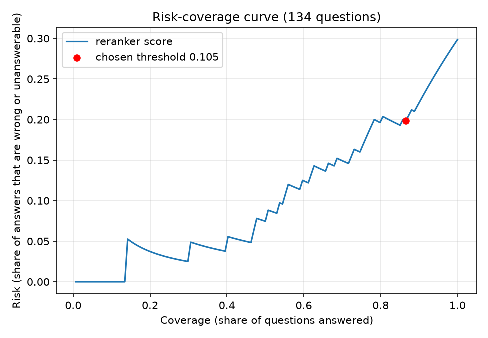

# Evaluation results

Benchmark: 150 auto-generated questions across pandas (1.5, 2.0, 2.2), NumPy (1.26, 2.1) and scikit-learn (1.3, 1.5),
50 per library. Trap questions (symbol absent in the user's version): 29. Recall questions: 121.
Library and version detection accuracy: 100.0%. Index: 3017 chunks.

| Config | Stale@1 (trap) | Stale@5 (trap) | Wrong-version@1 | Recall@5 | p50 ms | p95 ms |
|---|---|---|---|---|---|---|
| No version filter, no reranker | 69.0% | 100.0% | 48.0% | 96.7% | 253 | 296 |
| Version filter, no reranker | 0.0% | 0.0% | 0.0% | 98.3% | 268 | 307 |
| No version filter + reranker | 79.3% | 96.6% | 53.3% | 95.9% | 7483 | 9043 |
| Version filter + reranker (full system) | 0.0% | 0.0% | 0.0% | 100.0% | 8048 | 11823 |

Full system, per library:

| Library | Questions | Trap | Stale@1 | Stale@5 | Recall@5 |
|---|---|---|---|---|---|
| pandas | 50 | 12 | 0.0% | 0.0% | 100.0% |
| numpy | 50 | 12 | 0.0% | 0.0% | 100.0% |
| sklearn | 50 | 5 | 0.0% | 0.0% | 100.0% |

Definitions:
- Stale@1 / Stale@5: share of trap questions where the top-1 / any of the top-5 results is a symbol that does not exist in the user's library version.
- Wrong-version@1: share of all questions whose top-1 chunk belongs to another version of the library.
- Recall@5: share of recall questions where the correct symbol, in the user's version, is in the top 5.
- All configs filter by library (detected from the question); "version filter" adds the detected version.
- Latency: search only, per query, MacBook M1 CPU, after 3 warm-up queries.
- Caveat: questions are built from docstring summaries, so they leak some wording of the target symbol.
- The 80 hand-labeled samples (below) were drawn from the earlier pandas-only benchmark, not this one.

## Benchmark validation (hand-labeled)

- Question labels: 50/50 agree (100.0%)
- Version-validity labels: 30/30 agree (100.0%)
- Overall: 80/80 agree (100.0%)
- Method: 50 random benchmark questions and 30 (symbol, version) pairs checked by hand against the official pandas 1.5.3 and 2.2.3 docs pages. Raw labels: data/labels.csv.

## Production metrics (from logs/queries.jsonl)

- Queries logged: 20; cache hit rate: 50.0%
- Latency p50 / p95 (all): 2448 / 6327 ms
- Latency p50 / p95 (cache miss, full pipeline): 6052 / 6737 ms
- Latency p50 / p95 (cache hit): 0 / 0 ms
- Cost per query: $0.00 (total $0.00). It is zero because all models run locally on CPU, there are no paid API calls, and hosting is on a free tier.

## Abstention (confidence threshold)

Confidence = top reranker score (bge-reranker-base) after version-filtered hybrid retrieval. If it is below **0.105**, the app answers "Cannot confirm for your version."

Eval set (134 questions): 76 docstring-style answerable, 24 natural-phrased answerable (for example "remove duplicate rows pandas 2.2"), 14 trap (symbol removed or not yet added in the user's version), 20 off-topic.

How the threshold was chosen (full disclosure): a first threshold of 0.394, tuned on docstring-style questions only, answered just 54% of natural questions. A second rule (all answerable questions) gave 0.623 and dropped half of natural questions. The final rule, picked after seeing those results, maximizes (natural good answers kept) minus (off-topic questions let through), giving the threshold above.

| Metric | Value |
|---|---|
| Threshold | 0.105 |
| Coverage (share answered) | 86.6% |
| Risk (answered but wrong or unanswerable) at threshold | 19.8% |
| Risk with no abstention | 29.8% |
| Docstring-style questions still answered | 100.0% |
| Natural questions answered | 95.8% |
| Natural questions with a correct answer that are kept | 95.0% |
| Off-topic questions correctly abstained | 85.0% |
| Trap questions abstained | 0.0% |

Limitations: the threshold was tuned on the same questions it is evaluated on, with no held-out set. The natural set is only 24 hand-written questions. 3 of 20 off-topic questions still get answered. Abstention does not catch trap questions: with the version filter on, a removed symbol is replaced by a close neighbor that scores high. Traps are handled by the version filter (stale@1 0.0%) and the REMOVED/CHANGED notes. Some wrong answers also score high (for example a merge question returning `DataFrame.combine`), so a high score is not a guarantee.

## Delta indexing

Symbols whose text is identical across versions are stored and embedded once, with the list of versions they apply to (`applies`); search filters on library and that list (`docpilot/delta.py`, `scripts/build_index_delta.py`).

| | Naive (one chunk per symbol per version) | Delta |
|---|---|---|
| Chunks | 3017 | 2700 |
| Index size on disk | 45.3 MB | 41.2 MB |

Size reduction: **9.2%** (chunks: 10.5%; pandas 16.6%, scikit-learn 11.8%, NumPy 1.1%). The gain is small because most docstrings change at least slightly between versions, so few chunks are byte-identical. Stale@1 (0.0%) and recall@5 (98.35%, no reranker, 150 questions) are identical to the naive index. 127/150 top-5 lists are identical; the rest differ in order only. Limitation: unchanged-text detection is exact string match, with no near-duplicate merging.

## Embedding fine-tuning ablation

bge-small fine-tuned with MultipleNegativesRankingLoss on 1132 synthetic (question, chunk) pairs built from docstring summaries (2 epochs, lr 2e-5, batch 32). Symbols and summaries used in the 150-question benchmark or the 24 natural questions were excluded from training. Version filter on, no reranker. Benchmark = 121 recall questions (Recall@1, Recall@5) and 29 trap questions (Stale@1); Natural = 24 hand-written questions.

| Embedder | Retrieval | Recall@1 | Recall@5 | Stale@1 | Natural R@1 | Natural R@5 |
|---|---|---|---|---|---|---|
| base bge-small | dense | 81.0% | 98.3% | 0.0% | 54.2% | 91.7% |
| base bge-small | hybrid | 83.5% | 98.3% | 0.0% | 58.3% | 83.3% |
| fine-tuned bge-small | dense | 90.9% | 100.0% | 0.0% | 58.3% | 95.8% |
| fine-tuned bge-small | hybrid | 90.1% | 98.3% | 0.0% | 58.3% | 83.3% |

Caveats: training questions are synthetic templates over docstring first lines (the same source as the benchmark, so the benchmark is easier than real queries); NumPy ufunc docstrings start with a signature, which adds noisy pairs; the natural set is small.
